<p align="center">
  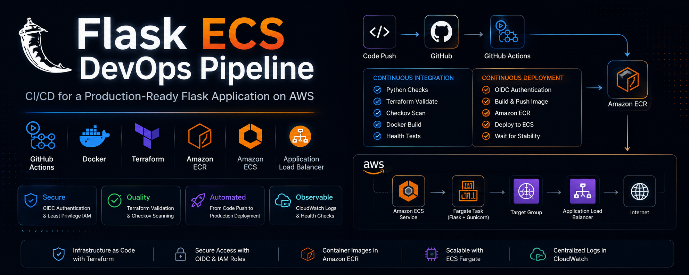
</p>

<h1 align="center">Containerized Flask Deployment on AWS ECS Fargate</h1>

<p align="center">
  <b>Infrastructure as Code + CI/CD for a production-style container platform on AWS</b><br>
  Terraform · Docker · Amazon ECS Fargate · ECR · ALB · CloudWatch · GitHub Actions (OIDC) · Checkov
</p>

<p align="center">
  
  
  
  
  
  
  
  
  
  
</p>

<p align="center">
  <a href="#-overview">Overview</a> ·
  <a href="#-key-capabilities">Capabilities</a> ·
  <a href="#-architecture">Architecture</a> ·
  <a href="#-cicd-pipeline">CI/CD</a> ·
  <a href="#-proof-it-runs">Proof It Runs</a> ·
  <a href="#-security-model">Security</a> ·
  <a href="#-repository-structure">Structure</a> ·
  <a href="#-deployment">Deployment</a> ·
  <a href="#-application-endpoints">Endpoints</a> ·
  <a href="#-roadmap">Roadmap</a>
</p>

---

## 📌 Overview

This project demonstrates the **complete deployment lifecycle** of a containerized web application on AWS — from commit to running task.

A lightweight Flask application is packaged into a **multi-stage Docker image**, published to **Amazon ECR**, and deployed onto **Amazon ECS Fargate** behind an **Application Load Balancer**. Every push to `main` is validated, security-scanned, and shipped automatically by a **GitHub Actions pipeline** that authenticates to AWS via **OIDC — no long-lived access keys involved**. All supporting infrastructure (networking, IAM, logging, container orchestration) is provisioned entirely with **Terraform**.

Unlike a traditional EC2 deployment, the application runs as an **immutable container workload**: infrastructure and application deployment are fully decoupled, so the same image can be redeployed repeatedly without touching the environment underneath it.

### 🧭 Evolution of this project

| Stage | Focus | Highlights |
|---|---|---|
| **v0** | AWS CLI Infrastructure | VPC, EC2, Bastion-as-NAT, SSH admin, CloudTrail + VPC Flow Logs → Wazuh |
| **v1** | Terraform Foundation | Same architecture rebuilt as code, still Bastion-as-NAT / SSH |
| **v2** | Secure Terraform Networking | Managed NAT Gateway, SSM administration, remote state, GitHub Actions CI, Checkov |
| **v3 — current** | Containerized Application Platform | Docker, ECS Fargate, ECR, ALB, CloudWatch, **and a full OIDC-authenticated GitHub Actions CI/CD pipeline** |

> The goal isn't a feature-rich Flask app — it's demonstrating how modern containerized workloads are actually built, secured, and shipped.

---

## ✅ Key Capabilities

| | |
|---|---|
| ✅ Multi-stage Docker image builds | ✅ Amazon ECS Fargate deployment |
| ✅ Production-ready Gunicorn app server | ✅ Amazon ECR container registry |
| ✅ Application Load Balancer + health checks | ✅ Private ECS tasks (no public IPs) |
| ✅ CloudWatch centralized logging | ✅ Infrastructure as Code with Terraform |
| ✅ Remote Terraform state (S3) | ✅ **CI: automated build, test & security scan** |
| ✅ **CD: automated ECS rolling deployment** | ✅ **Keyless AWS auth via GitHub OIDC** |
| ✅ Checkov static security scanning | ✅ Automated container publishing helper |

---

## 🏗️ Architecture

**Region:** `ap-south-1` · **Compute:** ECS Fargate · **Registry:** ECR · **App:** Flask + Gunicorn

<p align="center">
  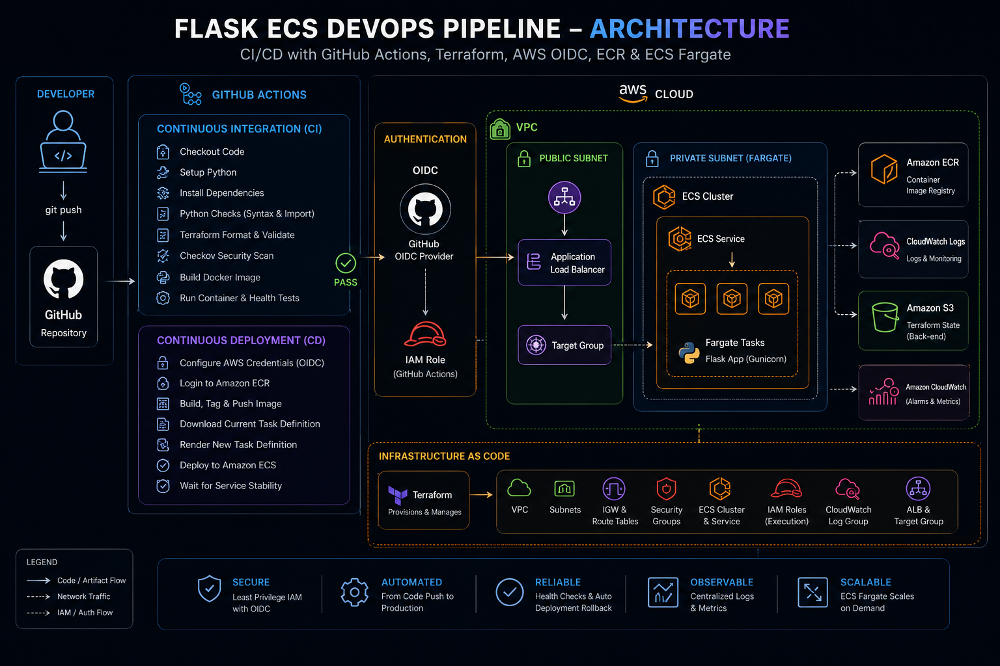
</p>

<details>
<summary><b>🧩 View native Mermaid definitions (system diagram + request sequence)</b></summary>

**System diagram**

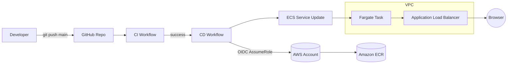

**Runtime request path**

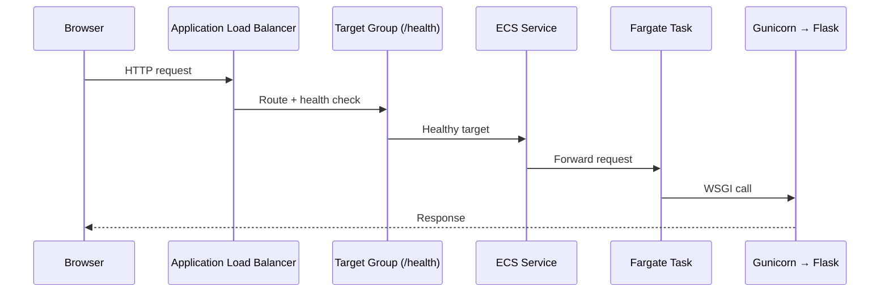

</details>

<table>
<tr>
<td valign="top" width="50%">

**Networking**
- VPC across multiple AZs
- Public + private subnets
- Internet Gateway
- NAT Gateway
- Public Application Load Balancer

**Container Platform**
- ECS Cluster
- ECS Task Definition
- ECS Service
- ECR Repository

</td>
<td valign="top" width="50%">

**Security**
- IAM execution role (least privilege)
- GitHub OIDC identity provider — no static AWS keys in CI
- Dedicated security groups per tier
- ECS tasks run in private subnets only
- ALB-to-task communication only

**Observability**
- CloudWatch log group (`/ecs/...`, 365-day retention)
- Gunicorn access + error logs
- `/health` endpoint wired to ALB target group

</td>
</tr>
</table>

---

## 🔄 CI/CD Pipeline

Every push to `main` runs through a **two-stage GitHub Actions pipeline** — no manual deployment steps.

<p align="center">
  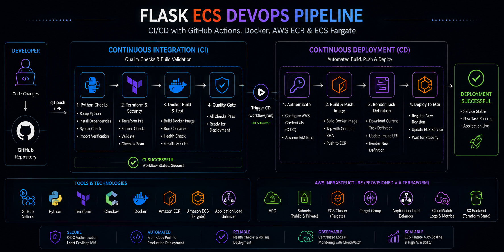
</p>

<details>
<summary><b>🧩 View native Mermaid definition of the pipeline</b></summary>

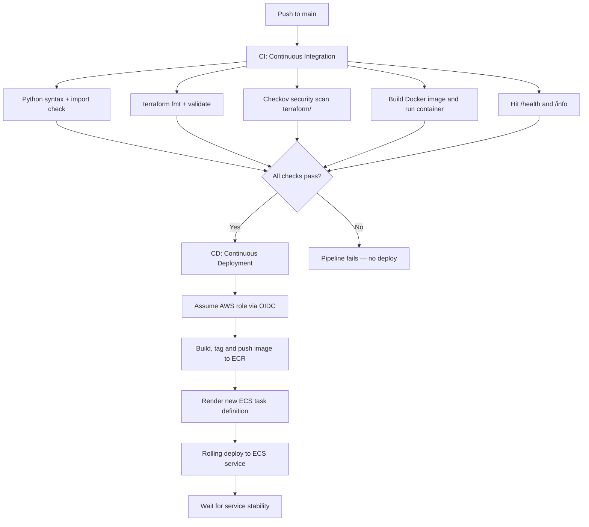

</details>

| Workflow | File | Trigger | What it does |
|---|---|---|---|
| **CI** – Continuous Integration | [`.github/workflows/ci.yml`](.github/workflows/ci.yml) | Push / PR to `main` | Validates Python syntax, formats & validates Terraform, runs **Checkov**, builds the Docker image, and smoke-tests `/health` + `/info` in a live container |
| **CD** – Continuous Deployment | [`.github/workflows/cd.yml`](.github/workflows/cd.yml) | On successful CI run against `main` | Authenticates to AWS with **OIDC** (`aws-actions/configure-aws-credentials`), pushes the image to ECR, renders a new ECS task definition, and performs a rolling deployment with `wait-for-service-stability` |

**Why this matters:** deployments only happen after tests and security scans pass, and the pipeline never touches a static AWS access key — the GitHub Actions runner exchanges its OIDC token for temporary, tightly-scoped credentials (see [Security Model](#-security-model)).

---

## 📸 Proof It Runs

<table>
<tr>
<td width="50%" valign="top">

**CI — all checks green**
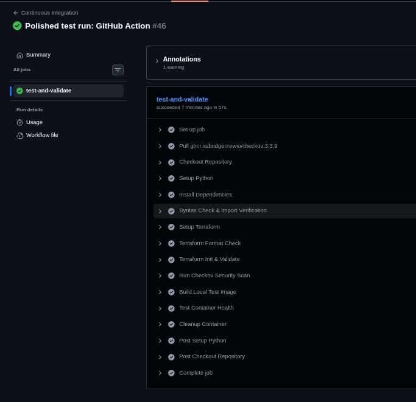

</td>
<td width="50%" valign="top">

**CD — OIDC auth → ECS deploy**
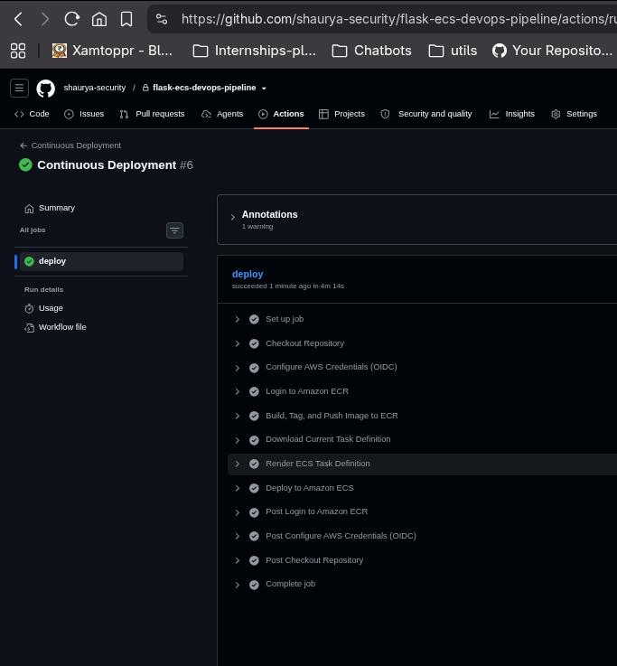

</td>
</tr>
<tr>
<td width="50%" valign="top">

**ECS service running in Fargate**
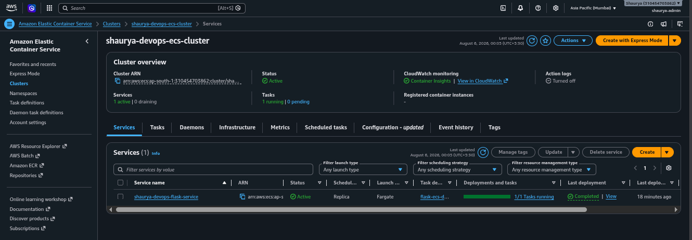

</td>
<td width="50%" valign="top">

**CloudWatch Container Insights**
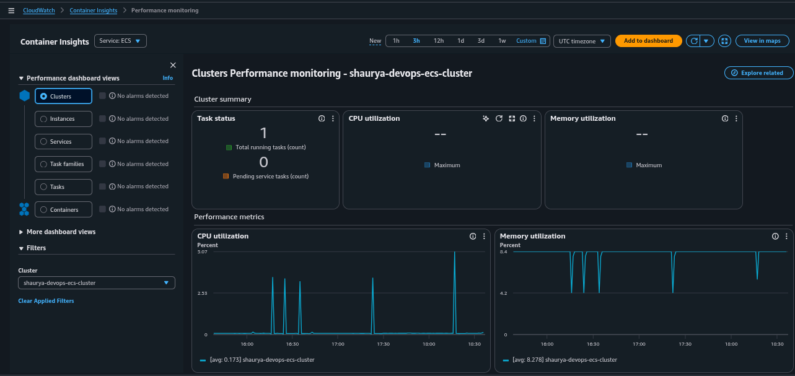

</td>
</tr>
</table>

**Live `/health` response from the deployed ALB:**

<p align="center">
  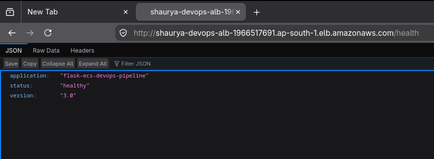
</p>

---

## 🔐 Security Model

- **No static AWS credentials anywhere.** `terraform/github_oidc.tf` provisions a GitHub OIDC identity provider and an IAM role that GitHub Actions assumes via `sts:AssumeRoleWithWebIdentity`.
- **Scoped trust policy** — the role's trust policy pins the token audience, restricts `sub` to this repo on `refs/heads/main`, and matches the exact `owner/repo` — not just "any GitHub Actions run."
- **Least-privilege IAM policy** for the CI/CD role: ECR auth is repo-scoped where possible, ECS actions are limited to describing/updating the specific service, and `iam:PassRole` is restricted to the ECS execution role only.
- **Static analysis on every PR** via Checkov, with intentional, documented skips in [`terraform/.checkov.yaml`](terraform/.checkov.yaml) rather than a blanket bypass.
- **Private-only compute** — Fargate tasks have no public IPs and are only reachable through the ALB target group.

---

## 📁 Repository Structure

```text
.
├── assets/                         # Diagrams & screenshots used in this README
│
├── .github/
│   └── workflows/
│       ├── ci.yml                  # Lint, validate, scan, build, smoke-test
│       └── cd.yml                  # OIDC auth → ECR push → ECS rolling deploy
│
├── app/
│   ├── app.py                      # Flask routes: /, /health, /info
│   ├── config.py
│   ├── Dockerfile                  # Multi-stage build → Gunicorn runtime
│   ├── requirements.txt
│   └── templates/
│
├── terraform/
│   ├── alb.tf
│   ├── cloudwatch.tf
│   ├── data.tf
│   ├── ecr.tf
│   ├── ecs.tf
│   ├── github_oidc.tf              # OIDC provider + CI/CD IAM role & policy
│   ├── iam.tf
│   ├── locals.tf
│   ├── network.tf
│   ├── variables.tf
│   ├── provider.tf
│   ├── backend.tf
│   ├── versions.tf
│   └── .checkov.yaml                # Documented Checkov skip list
│
├── terraform_bootstrap/
│   ├── backend.tf
│   ├── provider.tf
│   └── s3.tf                       # Remote state bucket
│
└── push-to-ecr.sh                  # Manual build/tag/push helper
```

---

## 🚀 Deployment

### Prerequisites

| Tool | Version |
|---|---|
| Terraform | ≥ 1.10 |
| AWS CLI | v2 |
| Docker | latest |
| AWS account | with permissions to create the above resources |

### 1️⃣ Bootstrap remote state

```bash
cd terraform_bootstrap
terraform init
terraform apply
```

### 2️⃣ Deploy infrastructure

```bash
cd terraform
terraform init
terraform apply
```

### 3️⃣ Build & publish the container

**Automatically:** push to `main` — CI validates, CD ships it.

**Manually (optional):**

```bash
./push-to-ecr.sh
```

### 4️⃣ Access the application

```text
http://<application-load-balancer-dns>
```

---

## 🌐 Application Endpoints

| Endpoint | Purpose |
|---|---|
| `/` | Application homepage |
| `/health` | ALB health checks |
| `/info` | Application metadata (version, server) |

---

## 🗺️ Roadmap

- [x] ~~GitHub Actions CI/CD pipeline~~ ✅ shipped in v3
- [x] ~~Automatic ECS rolling deployments~~ ✅ shipped in v3
- [ ] HTTPS with ACM
- [ ] Route53 custom domain
- [ ] ECS Auto Scaling
- [ ] AWS Secrets Manager for app config
- [ ] AWS WAF in front of the ALB
- [ ] Blue/Green deployments (CodeDeploy)

---

## 🔗 Related Projects

| Repository | Description |
|---|---|
| **aws-infra-cli** | AWS infrastructure provisioned using the AWS CLI |
| **terraform-aws-secure-vpc** | Secure AWS networking with Terraform |
| **aws-cloud-detection-pipeline** | Cloud detection engineering using AWS telemetry |

---

## 📄 License

This project is licensed under the **MIT License**.
